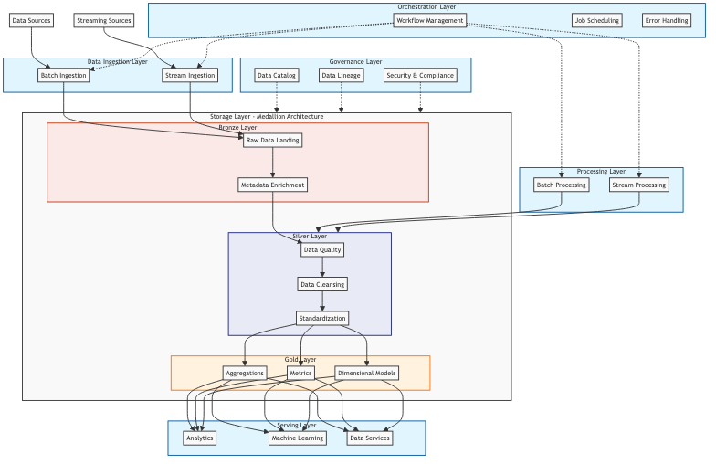

# Modern Data Platform Reference Architecture

This reference architecture combines modern data pipeline concepts with the medallion architecture pattern to create a scalable, maintainable, and efficient data platform.

## Architecture Overview

### Architecture Diagram



<details>
<summary>View Mermaid Source Code</summary>

```mermaid
[include architecture.mmd]
```
</details>

### 1. Data Ingestion Layer
- **Batch Ingestion**
  - File-based data sources (CSV, JSON, XML)
  - Database snapshots
  - API pulls
- **Stream Ingestion**
  - Real-time event streams
  - Change Data Capture (CDC)
  - IoT device data
- **Technologies**: Apache Kafka, AWS Kinesis, or Azure Event Hubs

### 2. Storage Layer (Medallion Architecture)

#### Bronze Layer (Raw Data)
- Raw data landing zone
- Exact copy of source data
- Immutable storage
- Metadata enrichment
- Source system tracking
- Technologies: Delta Lake, Apache Iceberg, or Apache Hudi

#### Silver Layer (Standardized)
- Data quality checks
- Schema enforcement
- Deduplication
- Type standardization
- Basic data cleansing
- Business rule application
- Master data integration

#### Gold Layer (Business)
- Aggregated tables
- Business metrics
- Dimensional models
- Department-specific views
- Pre-calculated KPIs
- Query-optimized formats

### 3. Processing Layer
- **Batch Processing**
  - Heavy transformations
  - Historical analysis
  - Data quality checks
- **Stream Processing**
  - Real-time analytics
  - Continuous transformations
  - Anomaly detection
- **Technologies**: Apache Spark, Apache Flink

### 4. Orchestration Layer
- Workflow management
- Job scheduling
- Dependency handling
- Error handling
- Retry mechanisms
- Technologies: Apache Airflow, Dagster

### 5. Serving Layer
- **Analytics**
  - Business Intelligence tools
  - Self-service analytics
  - Ad-hoc queries
- **Machine Learning**
  - Feature stores
  - Model training
  - Inference pipelines
- **Data Services**
  - REST APIs
  - GraphQL endpoints
  - Real-time dashboards

### 6. Governance Layer
- Data catalog
- Data lineage
- Access control
- Encryption
- Audit logging
- Compliance monitoring

## Key Features

1. **Scalability**
   - Horizontal scaling capabilities
   - Cloud-native design
   - Resource optimization

2. **Reliability**
   - Fault tolerance
   - Data quality checks
   - Automated recovery
   - Version control

3. **Maintainability**
   - Modular design
   - Clear separation of concerns
   - Documentation
   - Monitoring and alerting

4. **Security**
   - Role-based access control
   - Data encryption
   - Audit trails
   - Compliance features

## Best Practices

1. **Data Quality**
   - Validation at ingestion
   - Quality checks between layers
   - Data profiling
   - Anomaly detection

2. **Performance**
   - Partition strategy
   - Caching layers
   - Query optimization
   - Resource management

3. **Monitoring**
   - Pipeline metrics
   - Data quality metrics
   - System health
   - Business KPIs

4. **Development**
   - CI/CD integration
   - Testing framework
   - Documentation
   - Code reviews

## Implementation Guidelines

1. **Infrastructure Setup**
   - Cloud provider selection
   - Resource provisioning
   - Network configuration
   - Security setup

2. **Data Modeling**
   - Source analysis
   - Schema design
   - Transformation mapping
   - Business rules documentation

3. **Pipeline Development**
   - Modular code structure
   - Error handling
   - Logging
   - Testing strategy

4. **Deployment**
   - Environment strategy
   - Release process
   - Rollback procedures
   - Monitoring setup

## Technology Stack Recommendations

1. **Cloud Platform**
   - AWS, Azure, or GCP

2. **Processing**
   - Apache Spark
   - Apache Flink
   - Databricks

3. **Storage**
   - Delta Lake
   - S3/ADLS/GCS
   - Snowflake

4. **Orchestration**
   - Apache Airflow
   - Dagster

5. **Monitoring**
   - Prometheus
   - Grafana
   - Custom dashboards

## Scaling Considerations

1. **Data Volume**
   - Partitioning strategy
   - Storage optimization
   - Query performance

2. **Processing**
   - Compute resources
   - Memory management
   - Concurrent processing

3. **Cost**
   - Resource optimization
   - Storage tiering
   - Compute scheduling
