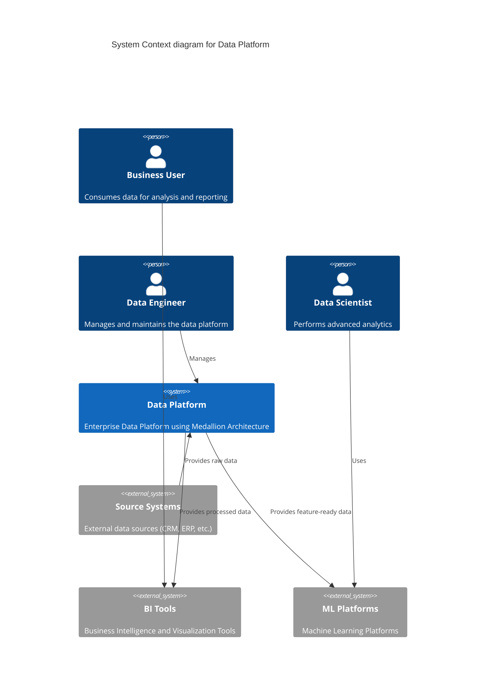
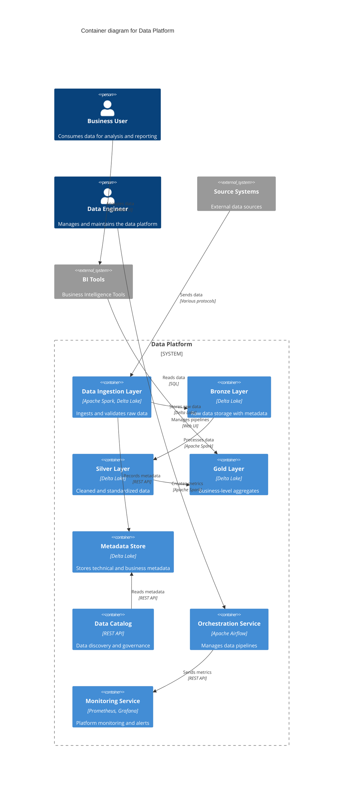
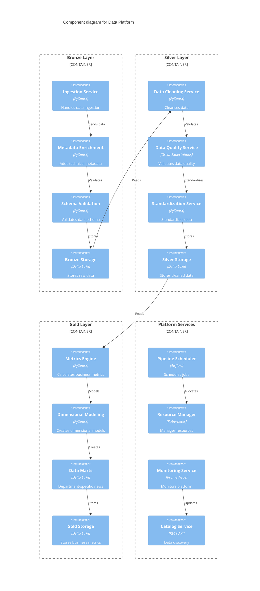

# C4 Model Diagrams for Data Platform Architecture

## Level 1: System Context Diagram

## Level 2: Container Diagram

## Level 3: Component Diagram

## Architecture Highlights

### Context Level
- Shows the high-level interaction between users, external systems, and the data platform
- Emphasizes the platform's role in serving different user personas
- Illustrates data flow from source systems to consumption points

### Container Level
- Details the main components of the medallion architecture
- Shows the relationship between different layers
- Includes supporting services like metadata, orchestration, and monitoring
- Demonstrates data flow and transformation stages

### Component Level
- Breaks down each layer into specific functional components
- Shows detailed data flow within each layer
- Illustrates how platform services support the data processing
- Demonstrates integration points between components

### Key Features Highlighted
1. **Data Processing Layers**
   - Bronze: Raw data ingestion and validation
   - Silver: Data cleaning and standardization
   - Gold: Business metrics and dimensional models

2. **Platform Services**
   - Metadata management
   - Data catalog
   - Orchestration
   - Monitoring and alerting

3. **Integration Points**
   - Source system connections
   - BI tool integration
   - ML platform support
   - Monitoring interfaces

4. **Data Flow**
   - Clear progression through layers
   - Transformation steps
   - Quality checks
   - Metric generation

Would you like me to:
1. Add more detail to any specific layer?
2. Include additional components?
3. Show specific data flows?
4. Add deployment views?
